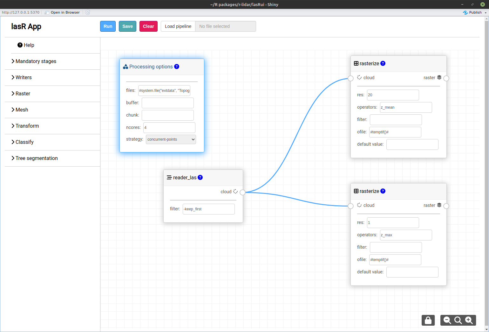

# lasRui


[](https://github.com/r-lidar/lasRui/actions/workflows/R-CMD-check.yaml)

> [!IMPORTANT]  
> This package is in a very early experimental stage. Regular backward-incompatible modifications will be made in the near future. Crashes of the R session are possible, and incorrect results may occur. It is public for curious people and will ultimately be added to [lasR](https://github.com/r-lidar/lasR).

`lasRui` is a Shiny application for the `lasR` package that allows building complex pipelines by dragging and dropping stages in a web interface and connecting the boxes.

## Installation

```r
install.packages('lasRui', repos = 'https://r-lidar.r-universe.dev')
```

## Example

In the following example, we draw a pipeline where we (1) assign a collection of files to process, (2) create a `reader_las()` stage to read the point <kbd>cloud</kbd>, and (3) connect the <kbd>cloud</kbd> to two `rasterize()` stages to produce two rasters.

``` r
library(lasRui)
lasRui()
```



## Features

- Drag and drop stages from the side menu
- Connect stages organically; stages must be connected by similar icons/names
- Save pipeline to a file
- Load saved pipeline
- Progress bar

